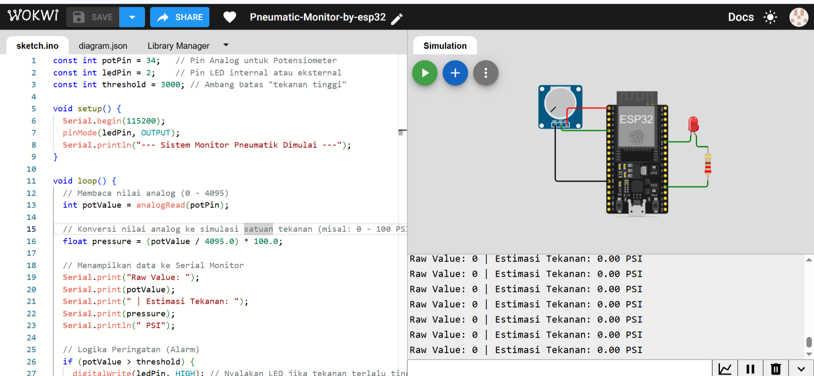

# 🛠️ Pneumatic Monitor System - ESP32

Sistem monitoring tekanan pneumatik menggunakan ESP32 dengan simulasi potensiometer sebagai sensor tekanan.

## 📋 Struktur Proyek
- **src/**: Kode program utama (`.ino` / `.cpp`).
- **docs/**: Dokumentasi teknis dan foto rangkaian.
- **diagram.json**: File simulasi Wokwi untuk mereplikasi rangkaian.

## 🔌 Pinout Rangkaian
| Komponen | Pin ESP32 | Keterangan |
| :--- | :--- | :--- |
| Potensiometer | GPIO 34 | Input Analog (ADC1) |
| LED Merah | GPIO 2 | Indikator Alarm |
| Resistor | 220 Ohm | Pelindung Arus LED |

## 📸 Dokumentasi Visual
